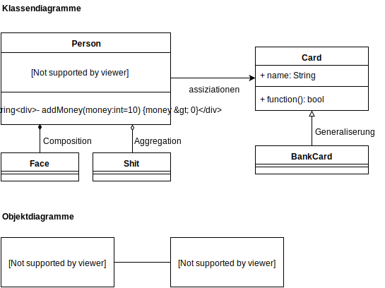
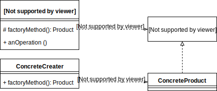
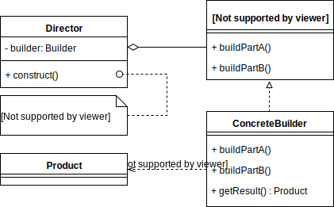
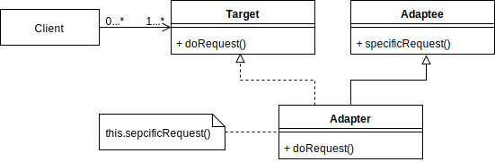
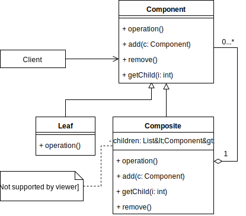
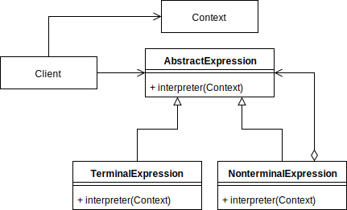
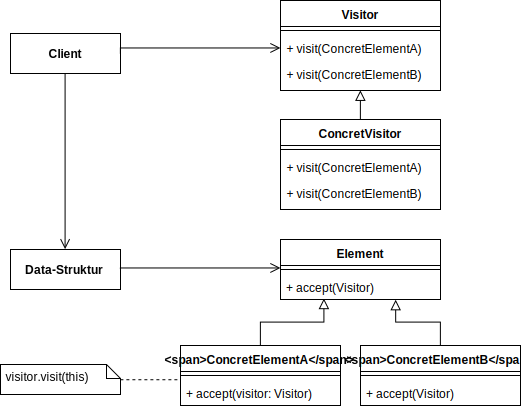
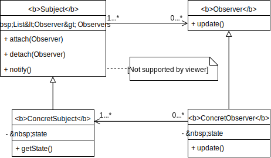

## Kapitel 2: Statische Sichten auf Klassen und Objekt

#### Allgemeines zur UML

* Strukturdiagramme
  * Objektstruktur
    * Klassendiagramme
    * Objektdiagramme
  * Modellstruktur
    * Packetdiagramme
  * Appliakationsarchitektur
    * Kompositionsdiagramme
    * Verteilungsdiagramme
    * Komponentendiagramme
* Verhaltensdiagramme
  * Anwendungsfalldiagramme
  * Zustandsdiagramme
  * Aktivitätdiagramme
  * Interaktionsdiagramme
    * Sequenzdiagramm
    * Kommunikationsdiagramm
    * Timingdiagramm
    * Interaktionsübersichtsdiagramm

#### Klassendiagramme

* Attributen
  * `[visibility][/] name [: type][multiplicity][=default][{property-­string}]`
* Klassenattributen <u>counter: int</u>
* Operation
  * `[visibility] name([parameter-­list]) [: return-­type][{properties}]`
* Parameter-list
  * `[direction] name: type [multiplicity][= default-­value]`
* Objektbeziehungen
  * Assoziationen
    * many-to-many, one-to-many, one-to-one
    * can use Assoziationsklassen (addtional table)
  * Aggregation *has a*
    * Assoziationen sind definiert in einer Class
    * Ganzes has Attributen von Teile
  * Komposition *own a*
    * one-to-many
    * Ganzes kontrollt Lebenszyklus von Teile
  * Generalisierung *is a*
  * 

#### Paketdiagramme

* Geliderungskriterien
  * Funktionale Geliederung
  * Architektonische Gliederung
* import: public import
* access: private import
* merge: meta-programming

#### Design by Contract

* Für Operationen zwischen Klassen entstehen die Verträge, wobei die Klassen bestimmte Invarianten damit erfüllen mussen. die Invarianten einer Klasse teilt sich in drei Teile
  * die *Vorbedingung* muss erfüllt sein, damit die Operation durchführbar ist.
  * die *Nachbedingung* muss bei Beendigung der Operation erfüllt sein
  * die *Invarianten* muss fast immer gelten
* Die Definition sagt nichts darüber aus
  * welche Zustände eingenommen werden, bevor die Operation terminiert.
  * wenn die Operation ohne erfüllte Vorbedingung ausgeführt wird
* Klasse gefahrlos durch eine andere ersetzt werden kann. Wenn
  * die gleichen oder stärkere Invarianten
  * die gleichen oder schwächere(!) Vorbedingungen
  * die gleiche oder stärkere Nachbedingungen

#### Objekt Constraint Lauguage (OCL)

* Typen
  * Boolean ( and, or, xor, not, implies )
  * Integer ( abs() )
  * Real ( floor() )
  * String ( concat(), size(), substring() )
* Kontext, Invarianten, Vorbedingung, Nachbedingung
```c++
/* Klasse Kontext */
context account:Account
inv: selt.balance >= 0 // invariant
/* Methode Kontext */
context Account::deposit(amt: Integer): void
pre:  amt > 0 // Vorbedingung
post: selt.balance = self.balance@pre + amt // Nachbedingung
      result = true // Zugriff auf Rückgabewert
```
* Typecast `selt.type.oclAsType(newType)`
* Typüberprüfung
  * `selt.type.oclIsTypeOf(student)`
  * `selt.type.oclIsKindOf(person)`
* Mengen (Account::allInstance())
  * Beispiel : `accounts->isEmpty()`
  * Standard operations
    * count(e), excludes(e), excludesAll(e), includes(e), includesAll(e), isEmpty(), notEmpty(), size,() sum()
  * Iteration operations
    * any(expr), collect(expr), exists(expr), forAll(expr), isUnique(expr) ...
* Bedingte Ausdrüken (if(...) then ... else ... endif)

## Kapitel 3: Dynamische Sichten auf Klassen und Objekte

#### Sequenzdiagramme

* Erzeugung / Zerstörung eines Objekt
* Asynchrone / Synchrone Nachrichten
* alt, par, opt, loop - break, ref

#### Pfadausdrücke

* expression (ex)
  * sequence `ex ; ex ; ex ; ...`
  * alternative `ex | ex | ex | ...`
  * parallel `ex + ex + ex + ...`
* operation (op)
  * parallel itself `{ op }`
  * repeat itself `[ op ]`
  * optional `(* op *)`

#### Statecharts

* Namenbereich
* Interner Zustandübergangsbereich
  * **Entry** Eintritt in den Zustand
  * **Do** während des Zustands
  * **Exit** Austritt aus den Zustand
  * **InternalTransition** ohne Zustandsänderung
  * **Aktivität** besteht aus einer Folge von **Aktionen**
* Zustandsübergang
  * Ereignis [Bedingung] / Effekt
  * Typen von Ereignissen
    * SignalTrigger, CallTrigger, TimeTrigger, ChangeTrigger
* Startzustand
* Endzustand
* Choise, Notation
* Zussammengesetzter Zustand
  * default Entry / Exit
  * explicit Entry / Exit
  * entry / exit Point
* Orthogonaler Zustand (AND-State)

#### Aktivitätsdiagramme

* Aktivitätsknoten
  * Aktion / Aktivität
  * Kontrollknoten
    * Start-Knoten
    * End-Knoten
    * Folk / Join Knoten
    * Decision / Merge Knoten
    * Sende Signal / empfange Ereignis
  * Objektknoten
* Fluss
  * Kontrollfluss
  * Datenfluss
* Pin (der Parameter einer Aktion)
* Partitionen (Aktivitäten nach der Veranwortlichkeit geliedern)

## Kapitel 4: Entwurfsmuster

#### Designentscheidungen

* Mikroarchitekturen
  * Modelle in Klassenstrukturen und Algorithmen in Aufrufketten umsetzen
  * nicht-funktionale Eigenschaften als Nebenziele
    * Flexibilität/Wiederverwendbarkeit
    * Testbarkeit
    * Portierbarkeit
    * Robustheit
* Entwurfmuster
  * Fragen bei Entwurf einer Mikroarchitektur
    * Welche Klassen/Objekte werden benötigt?
    * Wie fein muss die Funktionalität aufgeteilt werden?
    * Was ist die Schnittstelle nach außen?
    * Wie wird die Funktion hinter der Schnittstelle implementiert?
    * Wie flexibel werden Klassen gestaltet?
    * Wie eng werden Objekte aneinander geknüpft?
    * Welche Veränderungen müssen eingeplant werden?
    * Welche Randbedingungen müssen eingehalten werden?
  * Voteile bei der Wiederverwendungbewährter Architekturteile
    * Weniger Arbeitsaufwand für
      * triviale Probleme
      * Validierung
      * spätere Einarbeitung durch Wiedererkennung bekannter Muster
      * Wartung, Erweiterung und Portierung
  * Kategorien
    * nach Zweck
      * Erzeugungsmuster(Creational Patterns): Wie, wo und von wem werden Objekte zur Laufzeit erzeugt?
      * Strukturmuster(Structural Patterns): Wie wird Funktionalität zwischen Klassen/Objekten aufgeteilt?
      * Verhaltensmuster(Behavioral Patterns): Wie interagieren Objekte miteinander?
    * nach Wirkungsweise
      * Klassenmuster: Statische Problemlösung durch Vererbung und Schnittstellen
      * Objektmuster: Dynamische Problemlösung durch gegenseitige Aufrufe

#### Erzeugungsmuster

* Factory Method
  * 
  * Ziel: Erzeugungsprozess von außen kapselen
  * Lösungsansatz: spezielle Klassen übernehmt die Objekterzeugung
  * Vorteile:
    * Für neue Typen muss nur die Klasse geändert werden, nicht jeder Aufruf
    * Interner Aufbau komplexer Objekte wird gekapselt
  * **Creator**: Interface mit zwei Methoden
    * `anOperation()` : allgemeiner Erzeugungsprozess
    * `factoryMethod()` : spezieller Erzeugungsprozess
  * **ConcreteCreator**: implementiert `factoryMethod()`, return `ConcreteProduct`
  * **Product**: Interface
  * **ConcreteProduct**: implementiert Interface
* Builder
  * 
  * Ziel: Erzeugungsprozess eines komplexen Objekts von dessen Repräsentation trennen, so dass mit demselben Prozess verschiedene Repräsentationen erzeugt werden können
  * **Builder**: Interface für die Erzeugung einzelner Teile des Produkts.
  * **ConcreteBuilder**: Implementiert die Interface
  * **Director**: kontrollt über die schrittweise Erstellung des Produkts.
  * **Product**: Komplexe Objekte mit mehrer Bestandteile

#### Strukturmuster

* Adapter
  * 
  * Zwei Schnittstellen passen nicht zueinander. Ein zusätzliches Objekt soll Aufrufe von einer Schnittstelle an eine andere weiterleiten.
  * **Client**: Aufrufende Anwendung, die eine bestimmte Schnittstelle erwartet
  * **Target**: Die erwartete Schnittstelle
  * **Adaptee**: Die vorhandene Implementierung, die eine andere Schnittstelle anbietet
  * **Adapter**: Wrapper Klasse
* Composite
  * 
  * Ziel: Eine Struktur wird aus "Teil-Ganzes" Beziehungen aufgebaut und soll von außen gleichförmig behandelt werden.
  * **Client**: Aufrufende Anwendung, die Elemente gleichförmig behandeln will
  * **Component**: Schnittstelle zur Behandlung aller Element und zum Aufbau der Struktur
  * **Leaf**: Einfaches Element
  * **Composite**: Zusammengesetztes Element, implementiert Operationen

#### Verhaltensmuster

* Interpreter
  * 
  * Ziel: Bearbeitung von Input in eine Daten-Struktur nach der Syntex
* Visitor
  * 
  * Ziel: Auf einer Struktur sollen verschiedene klassenspezifische Operationen ausgeführt werden, ohne sie in jeder Klasse implementieren zu müssen.
  * **Visitor**:  Definiert eine Operation pro bekanntem ConcreteElement
  * **ConcreteVisitor**:  Implementiert die Schnittstelle
  * **Element**: Definiert eine Operation zur Annahme eines Visitors
  * **ConcreteElement**: Implementiert die Schnittstelle
* Observer
  * 
  * Ziel: Mehrere Objekte sind von einem Objekt abhängig und müssen über Zustandsänderungen informiert werden, um ihren eigenen Zustand zu aktualisieren

## Kapitel 5: Komponentenbasierte Anwendungen

#### Begriffe

* Komponenten
  * Lose Kopplung von der Umgebung
  * Schnittstellen beschreiben angebotene Funktionalität
* Konfiguration
  * Zusammengefügte Bausteine/Komponenten
* Komponentenmodelle
  * Umsetzung der Konfiguration zur Laufzeit als Ausführungsumgebung
* Komponenteninstanz
  * eine Implementierung von Komponenten

#### Komponenten

* Zentraler Punkt : Konnektoren
  * Beschreibung der Komponenten-Schnittstellen
    * Export: abstraktes Bild der Realisierung einer Komponente
    * Import: abstraktes Bild der zu benutzenden Komponenten
  * Semantische Eigenschaften
    * Signatur
    * Operations - Köpfe
  * Syntaktische Eigenschaften
    * Formale Schnittstellendefinition
    * Pfadausdrücke
  * Formaler Import
    * abstrakte Anforderungen an die zu benutzenden Komponente werden benannt
* Ansatz : Wiederverwendung
  * von kompletten Lösungen statt nur Lösungsansätzen
  * von Lösungen an entfernten Orten
* Ziele
  * Zeitersparnis
  * Bessere Softwarequalität
  * Plattformunabhängigkeit
  * Handel mit Komponenten statt mit fertigen Systemen
* Notwendige Eigenschaften
  * Wohldefinierter Zweck
  * Kontextunabhängigkeit
  * Portabilität
  * Ortstransparenz
  * Trennung von Implementierung und Schnittstelle
  * Selbstbeschreibungsfähigkeit
  * Sofortige Einsatzbereitschaft
  * Integrations- und Kompositionsfähigkeit

#### Parametrisierungen

* Ein- /Ausgabeparameter
* Systemparameter
* Komponentenparameter

#### Konfiguration

* Festlegung der Schnittstellen jeder Komponenten
* Berechnung der Common Parameter
* Bestimmung des Gesamtexports
* schrittweise Befriedigung der formalen Importe

#### Architekturmuster und -stile

* Architekturmuster und -stile
  * Muster : design Problem
  * Stile : development context
* Architekturstile
  * implicite Aufrufe (Inversion of control)
    * Publish-Subscribe
      * Empfänger melden sich bei potentiell interessanten Sendern an
      * Sender verwalten eine Liste der Empfänger und schicken Nachrichten an alle Empfänger
      * Empfänger holen sich die veröffentlichten Informationen ab
    * Event-based
      * Alle beteiligten Komponenten schicken Nachrichten ("Events") auf einen gemeinsamen Kommunikationskanal ("Event-bus")
      * Alle beteiligten Komponenten lesen von dort die Nachrichten, die sie interessieren
  * Datenfluss
    * Batch-Sequential
      * Für jede Aufgabe gibt es eine Komponente, die ein Datenpaket annimmt, es komplett verarbeitet und das bearbeitete Datenpaket zurück gibt
    * Pipes-and-Filters
      * Alle Komponenten dürfen parallel arbeiten
      * Informationen werden als Datenstrom von einer Komponente zur nächsten geleitet
* Architekturmuster
  * State-Logic-Display
  * Model-View-Controller
  * Sense-Compute-Control

#### Komponentenmodelle

* setzt die Theoie (Komponentenbasierte Entwicklung) in die Praxis als Ausführungsumgebung um
  * nicht komplett umgesetzt : keine semantische Beschreibung von Schnittstellen
* legt Standards fest
  * Beschreibung von Komponenten (manifest file)
  * Verbingung von Komponenten
  * Kommunikation zwischen Komponenten
  * Deployment von Komponenten

#### OSGi
