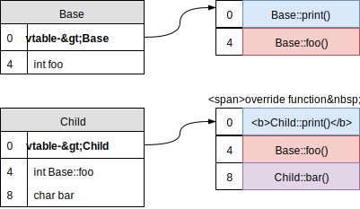

## 2. Programming in C

* Variables and Scope
```c
char  c;      /* 8 bits        */
short s;      /* min 16 bits   */
int   i;      /* 32 or 64 bits */
long  l;      /* min 32 bits   */
long long ll; /* min 64 bits   */
int octal = 08;      /* octal ingeger */
int hex   = 0x16;    /* hexadecimal   */
char oct_0 = '\060'; /* equal to '0' */
char hex_0 = '\x48'; /* equal to '0' */
```
* Enumerations
  * `enum typename { SYNC, ASYNC }`
* Operators
* Type Cast
```c
// larger to smaller : truncated at beginning
(char)251 == 1;
// signed to unsigned : raw bytes interpreted
(unsigned char)-100 == 156;
// float to integer : rounded towards zero
(int)1.7 == 1;
```
* Comma Operator
* Arrays
```c
/* Initializer list */
int n[5] = { 1, 2, 3, 4, 5 };
/*  If array size omitted, initializers determine size */
int n[]  = { 1, 2, 3, 4, 5 };
/* Multi-Dimensional Arrays */
int b[ 2 ][ 2 ] = { { 1 }, { 3, 4 } };
```
* Strings
* Pointers
  * Pointer Operators
    * adress operator
    * indirection/dereferencing operator
  * Pointer Arithmetic
  * Pointer Comparison
  * Relationship Array – Pointer
  * Arrays of Pointers
    * Example: Command Line Arguments
* Constant Values and Pointers
```c
/* nonconstant pointer to nonconstant data */
int *ptr
/* nonconstant pointer to constant data */
const int * ptr
int const * ptr
/* constant pointer to nonconstant data */
int * const ptr
/* constant pointer to constant data */
const int * const ptr
```
* References(only in C++)
  * aliases to other variables
  * must be initialized when declared
  * safer than pointers, but not as flexible
* typedef
* Structure
  * Structure Definitions
  * Accessing Structure Members
  * Initializing Structures
  * Drawbacks of Structures
  * Alignment
  * Bit Fields
  ```c
  struct Time {
      unsigned hour : 5;
      unsigned      : 3; // padding
      unsigned minute : 6;
      unsigned second : 6;
  }
  ```
* Union
* Control Structures
* Functions
```c
/* Important Functions */
#include stdio.h
#include string.h
#include math.h
#include stdlib.h
/* Functions Prototypes */
int foo( int x1, int& y, int* z );
/* Default Arguments and Call Types *
 * Names in prototype optional      *
 * Compiler ignores them            */
int foo( int x = 1, int& y = 2, int* z = 3 ) {
    // pass-by-value, orignal x is not changed
    x = 0;
    // pass-by-reference in C++, orignal y is changed
    y = 0;
    // pass-by-reference using pointer, orignal z is changed
    if(z) * z = 0;
}
int x = 3, y = 5;
int& ref_y = y;
foo(x, ref_y); // result : x = 3, y = 0
/* Variable Arguments Lists */
double average(int num,...) {
    va_list valist;
    va_start(valist, num);
    for (i = 0; i < num; i++) {
        sum += va_arg(valist, int);
    }
    va_end(valist);
    return sum/num;
}
/* inline Function */
inline double cube(const double s) { ... }
/* Function pointer */
int is_bigger(int a, int b) { return a > b; }  
int (* compare) (int, int);
compare = &is_bigger;
```
* Storage Classes
  * Automatic storage class
  * Static storage class
* Scope Rules
  * File scope
  * Function scope
  * Block scope
  * Function-prototype scope
  * Unitary Scope Resolution Operator (only in C++)
* Memory Layout of a Program
  * Stack
    * **EBP** : base pointer for the current stack frame
    * **ESP** : current stack pointer
  * Heap `malloc(size_t size); free(void * p);`
* The Preprocessor
```c
/*  Symbolic constants */
#define PI 3.14
/* Macros */
#define CIRCLE_AREA( x ) ( PI * ( x ) * ( x ) )
#undef CIRCLE_AREA
/* Replacement text token converted to string with quotes */
/* HELLO(WORLD) become printf("Hello " "WORLD" "!\n");    */
#define HELLO(x) printf("Hello " #x "!\n");
/* Concatenates two tokens     */
/* TOKENCONCAT(O, K) become OK */
#define TOKENCONCAT( x, y )  x ## y
```
*  Conditional Compilation
   `#ifdef, #ifndef, #elif, #else, #endif`
*  Predefined Symbolic Constants
   `__LINE__, __FILE__, __DATE__, __TIME__`
* Debugging with gdb
  * help (h)
  * quit (q)
  * disassemble (disas)
  * run (r)
  * continue (c)
  * print (p)
  * set <var = expr>
  * step (s) executes next line
  * next (n) executes the entire function
  * watch <expr>
  * backtrace (bt)

## 3. Introduction in C++

* **Function overloading**
  several methods sharing the same name but differ in
    * Parameter types
    * Number of parameters
    * Order of the parameters
* Namespaces
* Automatic type inference
* Range-based for loops `for (auto& x : arr)`
* **Lambda functions**
  * Usage `[&](int a, int b) { return names[a] < names[b]};`
  * Capture list
    * [] : no variables
    * [x, &y] : x captured by value, y captured by reference
    * [&] : capture all used variables by reference
    * [=] : capture all used variables by making a copy
    * [&, x, z] : capture all used variables by reference, except for x and z which is copied
    * [=, &y] : capture all used variables by copying them, but create a reference for y
    * [this]: capture the pointer of the enclosing class
* **Rvalue References**
  * inside functions Rvalue parameters will be converted to Lvalue
* Casting
* **Enums**
* Operator keywords

## 4. Class

* Constructors
  * Initialization order
  * Initializer list
* **Initialization**
  * Static variables : *Zero-initialized*
  * Stack / Heap : *Random Value*
  * No initialization in member declaration
* this pointer
* Member access
  * struct : default to public
  * class : default to private
* **When Constructors and Destructors Are Called**
  * Global scope objects
    * call ctor before **main()**
    * call dtor after **main()**
  * Automatic local objects
    * call ctor when entering scope
    * call dtor when leaving scope
  * *static* local objects
    * call ctor only once when execution reaches point where object defined
    * call dtor afer **main()** or **exit()**
* Separating Interface from Implementation
  * Using Set and Get Functions
  * Trap: Return Reference to Private Data Member
* Cascading Function Calls `return *this`
* const keyword
  * const objects
  * const member functions
    * **must be const** if it contains const objects
  * ctor and dtor : **cannot be const**
  * **mutable** : keyword for declaring new changeable variable inside const function
  * this pointer
    * In non-const function : `Foo * const`
    * In const function : `const Foo * const`
  * **const_cast** operator
* Copy-Constructor and operator=
  * Must check for self-assignment for operator=
* Constructor for Type Conversion
  * **explicit** Ctor
    * avoid implicit type conversion
    * avoid Ctor called for Type Conversion
    ```c++
    class Bar {
        // this is ctor
        explicit Bar(const Foo& foo) { ... }
        // this is ctor for type conversion
        Bar(const Foo& foo) { ... }
    };
    Foo foo;
    Bar bar;
    /*  c-style type cast              */
    bar = (Bar) foo;
    /* c++ functional cast             */
    /* Copy-Constructor will be called */
    bar = Bar(foo);
    ```
* **default** : only need prototype, no implementation necessary
* **delete** : disable definitions and avoid implicit type conversion
* Move-constructor and operator=
  * `Foo::Foo(Foo&& other)`
  * `Foo& Foo::operator=(Foo&& rhs)`
* friend keyword
  * not symmetric and not transitive
* static Class Members
  * static class variables
    * Class wide data like global variables have class scope
    * public : must using ::, e.g. `Foo::foo`
    * private : via `Foo::getFoo()`, which is also static function
  * static class function
    * cannot access non-static data or functions
    * no this pointer
* Pointers to Class Members

## 5. Operator Overloading

* Restrictions on Operator Overloading
  * Cannot change:
    * How operators act on built-in data types
    * Order of operations
    * Associativity
    * Number of operands
  * Cannot create new operators
  * Operators must be overloaded explicitly
  * Operators that cannot be overloaded
    * `.  .*  ::  ?:  sizeof`
* Operator Functions As Class Members Vs. As Friend Functions
  * Member functions
   * lhs : this pointer
  * Non member functions
    * lhs/rhs : two parameters
    * mus be **friend**
* Type Conversion Operators
```c++
class String {
    int length;
public:
    // Explicit Conversion Operators
    explicit operator int() { return length; };
};
String str;
/* Compile Error */
int i = str;
/* Compile OK    */
int j = (int)str;
int j = int(str);
```
* operator new and operator delete
  * Memory debugger
  * Logging
  * Optimized allocation for special cases
  ```c++
  void* operator new(size_t size);
  void operator delete(void* p);
  /* Array versions */
  void* operator new[](size_t size);
  void operator delete[] (void* ptr);
  ```

## 6. Inheritance and Polymorphism

* Type of Inheritance `class Circle : public Point`

| member    | public *inheritance*   | protected *inheritance*   | private *inheritance*   |
| :-------- | :--------------------- | :------------------------ | :---------------------- |
| public    | public                 | protected                 | private                 |
| protected | protected              | protected                 | private                 |
| private   | **inaccessible**       | **inaccessible**          | **inaccessible**        |

* **final** keyword
* Inheritance and Scoping (function overridden)
  * Members functions of base and derived class are in **different namespace**
  * Member functions are not part of class layout, only defined in namespace (see. Unter the hood)
  * solution for function overloading
  ```c++
  class Base { public:  void f(double); };
  class Derived : public Base {
  public:
      // import(copy) void f(double);
      using Base::f;
      // function overloading!
      void f(int);   
  };
  Base base; Derived derived;
  // call Base::f(double)
  derived.f(4.5);
  ```
* Constructors and Destructors in Derived Classes
  * Chain of constructor calls  `Derived(int foo) : Base(foo) { ... }`
  * Chain of destructor calls
  * base ctor and dtor are not inherited
  ```c++
  class Derived : public Base {
  public:
      // all (!) base constructors are explicitly inherited
      using BaseClass::BaseClass;
      // calls Base's copy-ctor
      Derived(Derived& other) : Base(other) { ... };
      // calls Base's move-ctor
      Derived(Derived&& other) : Base(std::move(other)) { ... };
  };
  ```
* Polymorphism
  * **virtual** keyword
  * Dynamic binding
    * Choose proper function to call at run time
    * Only occurs with pointer/reference
  * Abstract Classes
    * cannot make objects from abstract class
    * have pointers and references for polymorphism
    * at least one "pure" virtual function `virtual void foo() = 0;`
  * **override** keyword
  * **final** keyword
  * virtual dtor
    * problem : if Base class pointer is destroyed using delete, behavior unspecified
    * fix : when delete used appropriate destructor called
    * guideline: if a virtual member function exists, dtor must be virtual
  * **Constructors cannot be virtual**
* Summary Type Conversion
  * c-style Casting
  * const_cast
  * static_cast
  * dynamic_cast
  * reinterpret_cast
  * **typeid** keyword `typeid(object).name()`
  ```c
  Base base;
  Child child;
  const Child child_const;
  /* old c-style type cast */
  base = (Base) child;
  /* c++ functional cast */
  base = Base(child);
  /* const to non-const */
  Base *base_ptr = const_cast<Base*>(&child_const);
  /* static cast (occurs at complie time) */
  Base *base_ptr = static_cast<Base*>(&child);
  /* dynamic cast (occurs at run time)    */
  /* safe downcatsting with type-checking */
  Child *child_ptr = dynamic_cast<Child*>(&base);
  /* return NULL if casting failed */
  if(base_ptr) { doSomethingSafely(); };
  /* low level pointer conversion */
  Base *base_ptr = reinterpret_cast<Base*>(&child);
  ```
* Under the Hood
  * memory layout of object
    * **only** copies of data members
  * **dispatch** : function selection between base and overridden
  * Early binding
    * dispatch at complie time
    * functions are defined in class namespace with implicit this pointer as parameter `Base::print(this)`
  * Dynamic binding
    * dispatch at runtime
    * vtable
      * array of function pointer
      * first element(pointer of vtable) of each object
      * Derived vtable copy of base vtable
      * Override function: replace corresponding entry in vtable
      * 

## 7. Templates

```c++
/* class template with parameter i */
template< typename T, int i >
class Base {
public:
    Base(int = 10);
    const T& max(const T& a, const T& b);
private:
    T myVal;
};
/* outside of class definition     */
/* template <...> must be repeated */
template< typename T >
const T& Base<T>::max(const T& a, const T& b) { omitted(); }
/* overloading class template for specific type */
template<>
class Base< int > {};
/* Class template derived from class-template specialization */
template< typename C >
class Child : public Base<int> {};
/* Non-template Class derived from class-template specialization */
class Child : public Base<int> {};
```

## 8. Exceptions and Smart Pointers
* Exceptions
```c++
/* hander function when "new" failed                */
void no_memory () {
    std::cout << "Failed to allocate memory!\n";
    std::exit (1);
}
/* hander function when process terminates          */
void dump () {
    std::cout << "Unexpecd behaviors!\n";
}
/* register hander when allocation failed           */
std::set_new_handler(no_memory);
/* register hander when exceptions are never caught */
std::set_terminate(dump);
/* handle exceptions                                */
try {
    Base * base_ptr = new Base();
    Child * child_ptr = dynamic_cast<Child*>(base_ptr);
    // can throw almost anything, except object, int, etc.
    // this exception is never caught
    throw myException();
} catch (std::bad_cast& bc) {
    // what() to get informations
    std::cerr << "bad_cast caught: " << bc.what() << '\n';
}
/* catch all types of exceptions */
try {
    int nums[3] = {1, 2, 3};
    nums[5] = 5;
} catch (...) {
    // or using catch(exception AnyException)
    // but will not catch user-defined exceptions
    std::cerr << "out_of_range caught" << '\n';
}
```
* Smart Pointers
  * auto_ptr
    * has copy-semantic, but afterwards orignal pointers to NULL
    * this copy-semantic does not fit picture of c++11
    * so auto_ptr is deprecated by c++11
  * unique_ptr
    * resources are automatically released when pointer goes out of scope
  * shared_ptr
    * with counter
    * has cyclic-reference problem (like Deadlocks)
    * resources are automatically released when use_count() == 0
  * weak_ptr
    * break cyclic-reference problem
    * using lock() convert to *shared_ptr*

## 9. Strings

```c++
/* Initialization  */
string str( "Hello" );
string str( 8,  'x' );
string str = "Hello";
/* string lengh */
str.size();
str.length();
/* Assignment */
str = other;
/* equal to */
str.assign(other);
str.assign(other, 0, other.size() - 1);
str[0] = other[0];
/* Range checking */
/* throw out_of_range exception */
str.at(0);
/* Concatenation */
str.append(" World!");
/* equal to */
str += " World!";
/* Comparing strings */
str.compare(other);
/* "Hello" -> "He" */
str.substr(0, 2);
/* Swapping strings */
str.swap(other);
/* Number of chars without reallocation */
str.capacity();
/* Maximum possible string size */
str.max_size();
/* Returns true if empty */
str.empty();
/* Resizes string to newlength */
str.resize(newlength);
/* find functions */
str.find("Hello");
str.rfind("Hello");
str.find_first_of('a');
str.find_first_not_of('a');
str.find_last_of('a');
str.find_last_not_of('a');
/* "Hello" -> "He" */
str.erase(2);
/* "Hello" -> "HeLLo" */
str.replace(2, 2, "LL");
/* "Hello" -> "He__LLo" */
str.insert(2, "__");
/* convert to c-style char* */
const char *other;
/* other -> { 'H', 'e' } */
str.copy(other, 2, 0);
/* other -> { 'H', 'e','l', 'l','o' ,'\0' } */
other = str.c_str();
/* other -> { 'H', 'e','l', 'l','o' }       */
other = str.data();
```

## 10. IOstream


* **iosfwd** declarations for io template [link](http://www.cplusplus.com/reference/iosfwd/)
```c++
/* class templates for I/O  */
template <class charT, class traits=char_traits<charT> > class basic_ios;
/* typedefs istream, ostream, iostream */
typedef basic_ios<char> ios;
/* Unicode support */
typedef basic_ios<wchar_t> wios;
```
* **ios_base** base io members and fields
  * Member data
    * iostate : eofbit, failbit, badbit
    * **fmtflags** (bitmask)
      * Independent flags
        * **ios::boolalpha** : Alphanumerical bool values (ture/1)
        * **ios::showbase** : Show numerical base prefixes(0x2a/2a)
        * **ios::showpoint** : Show decimal point (42.)
        * **ios::showpos** : Show positive signs (+42/-42)
        * **ios::skipws** : Skip whitespaces
        * **ios::unitbuf** : Flush buffer after insertions
        * **ios::uppercase** : Generate upper-case letters(0XFF)
      * Numerical base format flags
        * dec(42), hex(2a),  oct(52)
      * Floating-point format flags
        * fixed(2017.000), scientific(2.017e+003)
      * Adustment format flags
        * internal, left, right
    * **openmode**
      * **ios::app** : can only append bytes
      * **ios::ate** : move cursor to end, write anywhere
      * **ios::in** : read-only
      * **ios::out** : write-only
      * **ios::trunc** : empty file content
      * **ios::binary** : for Random-Access Files
    * **seekdir** : beg, cur, end
  * Formatting functions
    * width()
    * precision()
  * defines fmtflags Manipulators
* **ios**
  * fill()
  * tie()
  * State flag functions
    * eof(), good()...
* **ostream**
  * Unformatted output `cout.put('A').write(buffer,size);`
  * Formatted output `cout << "Hello World";`
  * Positioning
    * **tellp()** get position
    * **seekp(streamoff offset, ios_base::seekdir way)** set cursor
* **istream**
  * Unformatted output
    * **get()** get one byte
    * **get(char *, size_t, delim)** get size-1 bytes
      * delimiter default `\n`
      * delimiter need to be removed from end
    * **getline(char *, size_t, delim)** get a line
    * **read()** read block of raw bytes
    * **ignore()** ignore a byte
    * **putback()** put back byte from get()
    * **peek()** get next byte, but does not remove
  * Formatted output `cin >> var;`
  * Positioning
    * **tellg()** get position
    * **seekg(streamoff offset, ios_base::seekdir way)** set cursor
* **iostream** provide standard io objects
  * cin, cout, cerr, clog(buffed error)
* **iomanip**
  * **std::setiosflags**
  * **std::setfill**
  * **std::setbase**
  * **std::setprecision**
  * **std::setw**
* Random-Access Files
```c++
/* user-defined record */
struc Record {
    uint8_t error_code;
    bool reviewed;
}
/* open file stream */
fstream file("log.txt", ios::binary);
/* work through the file */
while (file.good()) {
    file.read(reinterpret_cast<char*> (&record), sizeof(Record));
    std::cout << recode->error_code << std::endl;
    record->reviewed = true;
    // update the record
    file.write(reinterpret_cast<char*> (&record), sizeof(Record));
    // move forwards to next record
    file.seekg(sizeof(Record), ios::cur);
}
```

## 11. Threads

* Implementation
```c++
void func(int& param);
// functor class
class runnable {
public:
    void operator()() const;
}
// functor passed
std::thread class_thread(runnable);
// lambda function
std::thread lambda_thread([](){ omitted ... });
```
* Passing Parameters to the Thread
```c++
int x;
void func(int& param);
// thread() is not aware if parameters should be passed by reference
std::thread func_thread(func, std::ref(x));
```
* Thread Lifetime
```c++
int x;
void func(int& param);
// thread() is not aware if parameters should be passed by reference
std::thread joinable(func, std::ref(x));
std::thread non_joinable(func, std::ref(x));
// waits for the end of the thread
joinable.join();
// child thread execute independently from main thread and non-joinable
non_joinable.detach();
```
* Returning Values from Threads
```c++
int x;
void func(int& param, std::promise<bool> p);
// A promise object can store a value of a certain type
// This value can later be retrieved by the associated future object
// A thread can query or wait for the availability of the future
std::promise<bool> prom;
std::future<bool> fut = prom.get_future();
std::thread non_joinable(func, std::ref(x), std::move(prom));
// block only for a certain amount of time or until a specific time point
std::chrono::milliseconds span(100);
while (fut.wait_for(span) == std::future_status::timeout) {
     std::cout << '.' << std::flush;
}
bool result = fut.get();
```
* Copying and Moving of Threads
  * Threads cannot be duplicated!
  * Threads can be moved, i.e. ownership is transfered
* Thread Information
  * **std::this_thread::get_id()**
    * Each thread has a unique id
  * **std::thread::hardware_concurrency()**
    * suggests the number of threads that can run concurrently in an optimal way
* Management of Multiple Threads
  * Multiple threads can be managed in containers, e.g. vector or list
    * `std::vector<std::thread> threads`
  * This eases joining of all threads
    * `std::for_each(threads.begin(), threads.end(), std::mem_fn(&std::thread::join))`
* Keyword **thread_local** for thread storage duration of a variable
  * Each thread gets its own copy!
  * Initialized with 0 automatically
  * When applied to different block scopes, automatically to **static**
* Asynchronous Functions
  * `std::future<bool> fut = std::async(func,42)`
* Mutex
```c++
/* ---------- simple basic mutex ---------- */
std::mutex mutex;
mutex.lock();
doSomethingSafely();
mutex.umlock();
/* ---------------- try_lock -------------- */
// try to obtain the mutex without blocking
if (mutex.try_lock()) // enter critical area
    doSomethingSafely();
    mutex.unlock();   
else // continue with other jobs
/* -------------- timed mutex ------------ */
std::timed_mutex timedMutex;
if (timedMutex.try_lock_for(std::chrono::milliseconds(1))
    doSomethingSafely();
    timedMutex.unlock();
/* ----------- recursive mutex  ---------- */
std::recursive_mutex recursiveMutex;
/* -------- recursive timed mutex  ------- */
std::recursive_timed_mutex recursiveTimedMutex;
```
* lock
  * lock_guard
    * Mutex is immediately locked when created;
    * `std::lock_guard<std::mutex> guard(mymutex)`
  * unique_lock
    * has lock() and unlock() operations (lock_guard does not have)
    * `std::unique_lock<std::mutex> ulck(mymutex, std::defer_lock)`
  * shared_lock (since c++17)
    * works with **shared_mutex**
    * for read operations `std::shared_lock<std::shared_mutex> lock(sharedMutex);`
    * for write operations `std::unique_lock<std::shared_mutex> lock(sharedMutex);`
* Deadlocks
* Atomic
  * declaration `std::atomic<T>`
  * without using mutexes/locks
* Condition Variables
```c++
std::condition_variable cv;
/* Acquires a lock (must be a unique_lock!)  */
std::unique_lock<std::mutex> lk(m);
/* Notifies waiting threads                  */
/* or notify_all()                           */
cv.notify_one();
/* Waits on condition with lock as parameter */
/* or wait_for(), wait_until()               */
cv.wait(lk, []{ return is_ready; });
```

## 12. Data Structures & Algorithms

* Standard Template Library
  * **Containers**: template data structures
    * Sequence containers
      * vector, deque
      * list
    * Associative containers
      * Bidirectional iterators
      * set, multiset, map, multimap
    * Container adapters
      * no iterators
      * stack, queue, priority_queue
  * **Iterators**: like pointers, access elements of containers
  * **Algorithms**: data manipulation, searching, sorting, etc.
* vector
  * Random-Access iterator
  * **contiguous** memory locations
  * pop/push at end only
  * allocate new, copy data, deallocate old
  * STL : increase by factor 2
* deque
  * Random-Access iterators
  * pop/push both at front and end
  * STL : array of fixed size array
* list
  * Bidirectional iterators
  * Doubly-linked list
* Tree Data Structure
  * root, child, degree, leaf, siblings, depth
* Binary Search Trees
* Hash table
  * properties
    * Equal objects hash to equal values
    * Randomly selected unequal values are very unlikely to have equal hash values
    * Even distribution in 0, ..., M – 1 (no clustering)
  * Conflict Resolution
    * Each hash table entry is a container
* multiset / set
  * only values
  * **multiset : allows duplicate values**
* multimap / map
  * intsert key-value pair `mymap.insert( std::pair<char,int>('z',200) );`
  * **multimap : multiple values for a single key**

## 13. STL Algorithms

* Iterator definition
```c++
template <class Category, class T, class Distance = ptrdiff_t,
    class Pointer = T*, class Reference = T&>
struct iterator {
  typedef T         value_type;
  typedef Distance  difference_type;
  typedef Pointer   pointer;
  typedef Reference reference;
  typedef Category  iterator_category;
};
```
* Iterator Categories
  * all categories
    * can be incremented `i++, ++i`
  * input_iterator_tag
    * defined as `struct input_iterator_tag {};`
    * equality/inequality comparisons
    * can be **dereferenced as an rvalue** `std::cout << *i`
  * output_iterator_tag
    * can be **dereferenced as an lvalue** `*i = new_value`
  * forward_iterator_tag
  * bidirectional_iterator_tag
    * can be decremented `i--, --i`
  * random_access_iterator_tag
    * arithmetic operators `i + n, i += n, i < j`
* Const Iterator
* Reverse Iterator
* Iterator for first-class container
  * `std::CONT<T>::iterator`
* Algorithm Categories
  * Non-modifying algorithms
    * Comparison
      * equal, mismatch, lexicographical_compare
    * Search & Sort
      * find, find_if, sort, binary_search
  * Modifying algorithms
    * fill, fill_n, generate
    * replace, replace_if, replace_copy, replace_copy_if
    * swap, iter_swap, swap_ranges
  * Mutating Algorithms
    * copy_backward, merge, reverse, inplace_merge, unique_copy, reverse_copy
  * Removal Algorithms
    * remove, remove_copy, remove_if, remove_copy_if, unique
  * Numeric Algorithms
    * accumulate, for_each, transform, random_shuffle, count, count_if, min_element, max_element
  * Set Operations
    * includes, set_difference, set_intersection, set_symmetric_difference, set_union
  * Range
    * lower_bound, upper_bound, equal_range
  * Heapsort
    * make_heap, sort_heap, push_heap, pop_heap
* Class bitset
* STL Function objects
```c++
/* base class definition */
template <class Arg1, class Arg2, class Result>
struct binary_function {
    typedef Arg1 first_argument_type;
    typedef Arg2 second_argument_type;
    typedef Result result_type;
};
/* plus<T> */
template <class T> struct plus : binary_function <T,T,T> {
    T operator() (const T& x, const T& y) const {return x+y;}
};
```
