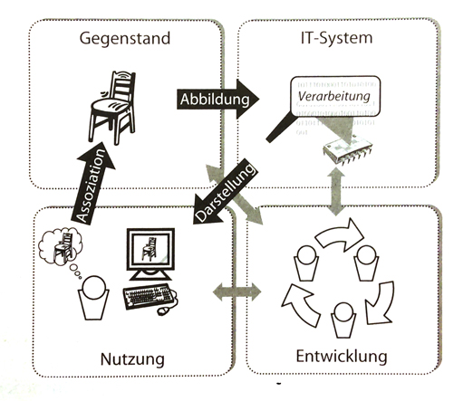
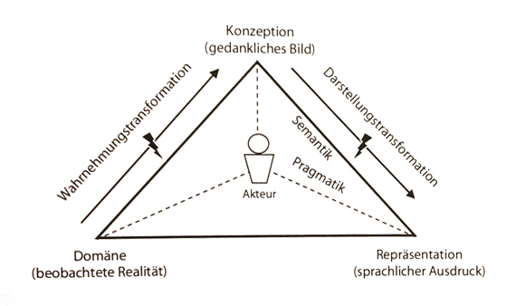
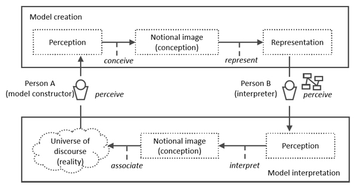

## 2.1 Anforderungsbegriff

**Definition**: Eine **Anforderung** ist

- Eine Bedingung oder Eigenschaft, die ein System oder eine Person benötigt, um ein Problem zu lösen oder ein Ziel zu erreichen
- Eine Bedingung oder Eigenschaft, die ein System oder eine Systemkomponente aufweisen muss, um eien Vertrag zu erfüllen oder einem Standard, einer Spezifikation oder einem anderen formell auflegten Dokument zu genügen
- Eine dokumentierte Repräsentation einer Bedingung oder Eigenschaft wie in (1) oder (2) definiert

**Definition**: Eine **Anforderungsartefakt** ist eine dokumentierte Anforderung

## 2.2 Anforderungsarten

- Funktionale Anforderungen
  - definiert eine vom System bzw. von einer Systemkomponente bereitzustellende Funktion oder eiein bereitzustellenden Service
- Qualitätsanforderungen
  - qualitative Eigenschaften des Ganzsystems, einer Funktion oder Funktionsgruppen
- Rahmenbedingungen (Restriktionen)
- Nichtfunktionale Anforderungen
  - unterspezifizierte Anforderungen(Anforderungensgruppen)

**Einschänkende Wirkung von Rahmenbedingungen**

  * Rahmenbedingungen definieren Einschänkungen im Hinblick auf die Umsetzung von funktionalen Anforderungen und Qualitätsanforderungen.
  * Rahmenbedingungen schränken die Zahl möglicher Realisierungen der Anforderungen bzw. eins Systems.

## 2.3 Problem vs. Lösung

- Was versu Wie im Entwicklungsprozess eines Systems
 - Requirements-Ingenieur --- Was, Systemachitektur --- Wie
 - Der Entwicklungsprozess alterniert zwischen Problemdefinition und Lösungsbeschreibung
- Einschränkung des Lösungsraums entlang des Entwicklungsprozesses
 - Durch die Wechselwirkung zwischen Problemdefinition und Lösungsbeschreibung wird die Anzahl der möglichen Lösungen in jeder Entwicklungsprozesses sukzessive verringert
 - bis auf die Ebene der Implementierung

**Wechselwirkungen zwischen Anforderungen und Systemarchitektur**

- Anforderungen als Grundlage für den Entwurf der Systemarchitektur
- Im Architekturentwurf werden auch Erkenntinisse gewonnen, die Auswirkung auf die Anforderungen haben

## 3.1 Traditionelle Systemanalyse

- Gegenstand der Systemanalyse ist die Untersuchung existierender Systeme oder Prozesse mit dem Ziel, Anforderungen an ein geplantes System zu entwickln, das die vorhandenen Systeme und Prozesse automatisiert und damit ersetzt
- Die traditionelle Systemanalyse beschreibt die gewüschten funktionalen Aspekte eines Systems in Form von Daten, Funktionen und Verhalten, sie bilden dabei drei Perspektiven zur Beschreibung funktionaler Anforderungen

**Ist-Analyse**

- Fakten über existierende Systeme und Prozesse ermittelt und in IS-Modell dokumentiert
- die wichtigen Kontextinformationen werden gewonnen

**Soll-Analyse**

- Verbesserungsmöglichkeiten werden identifiziert und das Soll-Modell erstellt
- die geplanten Änderungen auf Modellebenne werden in das Ist-Modell integiert.Dadurch entsteht das Soll-Modell

## 3.3 Requirements Engineering als Phase

In vilen Lebenszyklus- und Prozessmodellen, wie z.B dem **Wassermodell** oder dem **V-Modell** wird das RE als **eine singuläre Phase** in der Software-Entwicklung angesehen. Aufgabe des RE ist die Erstellung eiener **Anforderungssepzifikation**

## 3.4 Nachteil der Systemanalyse und des phasenbezogenen RE

- Wandel in der Systementwicklung
 - neue Technologie
- Unzureichende methodische Unterstützung
 - Keine Kontinutität --> Felende Aktualsierung der Anforderungen
 - Notwengdigkeit von Ist-Analyse --> Hoher Aufwand für Ist -Analysen
 - Keine Systematische Wiederverwendung von Anforungen
 - Produktfokussierung

## 3.5 Kontinuierliches RE
- Phaseübergreifendes RE
- Projektübergreifendes RE

**Die wesentlichen Vorteile**

- Systematischer Lernprozess
- Anforderungen sind immer aktuell
- kürzere Produktentwicklungszeiten
- Projektübergreifende Wiederverwendung
- Klare Zuständigkeiten

## 4.1 Überblick über das Rahmenwerk

**Vision**

- Vision definiert angestrebte Veränderung der aktuellen Realität
- Vision als Leitgedanke
- Vision beschreibt ein Ziel, keine Realisierung

**Etablierung einer Vision im Kontext**

- Ein System ist immer in eine Umgebung eingebettet
- Der Systemkontext beeinflusst maßgeblich die Anforderungen an das System
- Adäquate Berücksichtigung an das Systemkontext ist eine Voraussetzung für das Requierment Engineering und die Entwicklung des System

## 4.2 Vier Kontextfacetten
- **Gegenstandfacette** umfasst alle Gegenstände und Ereignisse, die ein System berücksichtigen muss
- **Nutzungsfacette** umfasst alle für das geplante System relevanten Aspekte, die die Systemverwendung einschränken oder beeinflussen
- **IT-Systemfacette** umfasst alle Kontextaspekte, die sich aus der existierenden oder zukünftigen IT-Umgebung ergeben, einschließlich der existierenden IT-Strategien
- **Entwicklungsfacette** umfasst alle Kontextaspekte, die die Entwicklung des geplanten Systems betreffen bzw. beeinflussen

## 4.3 Die fünf Aktivitäten
**Drei Dimensionen des RE**

- Inhalt
- Übereinstimmung
- Dokumentation

**Definition: Das RE ist ein kooperativer, iterativer, inkrementeller Prozess dessen Ziel es ist zu gewährleisten, dass**

- alle relevanten Anforderungen bekannt und in dem erforderlichen Detaillierungsgrad verstanden sind
- die involvierten Stakeholder eine ausreichende Übereinstimmung über die bekannten Anforderungen erzielen
- alle Anforderungen konform zu den Dokumentationsvorschriften dokumentiert bzw. konform zu den Spezifikationsvorschriften spezifiziert sind

### 4.3.1 Die drei Kernaktivitäten
#### Dokumentation
- Anforderungen gemäß der Dokumentationsvorschriften zu dokumentieren
- Anforderungen gemäß der Spezifikationsvorschriften zu spezifizieren
- die Begründungen, Entscheidungen und weitere Informationen bei der RE-Aktivitäten zu dokumentieren
- Abhängig vom Anwendungszweck werden die Anforderungen in geeigneten Dokumentationsformaten festgehalten
- Die Konsistenz zwischen den vershiedenen Dokumentationsformaten muss sichergestellt werden

#### Gewinnung
- Identifikation von Anforderungsquellen
- Gewinnung von existierenden Anforderungen
- innovative Anforderungen zu entwicklen

Relevante Anforderungsqullen sind

- Befragung von Stakeholder
- Analyse von existierenden Systemen
- Analyse von existierenden Dokumenten

#### Übereinstimmung
Konflikte unter den Stakeholden über die bekannten Anforderungen aufzudecken und aufzulösen

### 4.3.2 Die zwei Querschnittaktivitäten
#### Validierung
- **Validierung der Anforderungsartefakte**
  - Fehler in Anforderungen aufzudecken
- **Validierung der Aktivitäten**
  - Konformität der durchgeführten Aktivitäten zu Prozessvorgaben und Aktivitätbechreibungen zu überprüfen
- **Validierung der Kontextbetrachtung und -berücksichtigung**
  - ob die relevanten Kontextaspekte der vier Kontextfacetten vollständig und korrekt erfasst sowie zu den entsprechden Zeitpunkt im RE-Prozess berücksichtigt werden

#### Management
- **Management der Anforderungsatefakte**: die Verwaltung der Anforderungsatefakte über den gesamten Lebenzyklus
  - die Ablage der Anforderungen
  - die Priorisierung von Anforderungen
  - das Konfigurationsmanagement
  - die Gestaltung der Nachvollziehbarkeit
  - das Änderungsmanagement für Anforderungen
- **Management der Aktivitäten**
  - Plannung, Steuerung und kontrolle der durchgeführten Aktivitäten
  - eine effektive und effiziente Durchführung dieser Aktivitäten sicherzustellen
- **Beobachtung des Systemkontexts**
  - Veränderungen des Kontexts zu identifizieren
  - zusätzliche Aktivitäten anzustoßen
  - die Reihenfolge der Aktivitäten zu veränderen

## 4.4 Die drei Arten von Anforderungsartefakten

**Ein Anforderungsartefakt ist eine dokumentiere Anforderung unter Verwendung eines bestimmenten Dokumentationsformats**

- **Ziele**
  - dokumentieren die Intentionen der Stakeholder
  - abstrahieren dabei von der Nutzung des Systems und Aspekten der Systemrealisierung
  - verfeinen die Vision auf die einzelne Merkmale des geplannten Systems
  - sind meistens hierarchisch strukturiert, wobei ab der Wurzel der Hierarchie die Vision steht
- **Szenarien**
  - beschreiben konkrete Beispiele für Interaktionsfolgen zur Erfüllung eines definierten Ziels
  - werden in Form von Use Case dokumentiert
  - verbesseren die Nachvollziehbarkeit von Zielen
- **Lösungsorientierte Anforderungen** 
  - spezifizieren die Anforderungen auf die Detailsebene, die ausreichend für die Unterstützung von Entwicklungsaktivitäten, Design und Test
  - impizieren konzeptuelle und logische Lösungen
  - soll konfliktfrei sein
  - soll akzeptiert von alle Stakehoder
  - soll vollständig sein

**Drei Typen von lösungsorientierter Anforderungen** 

- Daten
- Funktion
- Verhalten

## 5.1 Der Kontextbegriff
*   Ein System ist immer in eine Umgebung eingebettet
*   Die Umgebung beinhaltet materielle und immaterielle Objekte (Kontext-Obejekt)
*   Der Systemkontext beeinflusst maßgeblich die Anforderungen an das System
*   Adäquate Berücksichtigung an das Systemkontext ist eine Voraussetzung für das Requierment Engineering und die Entwicklung des System

### 5.1.1 Definitionen
* **System** sind materielle und immaterielle Objekte, die innerhalrb der Systemgrenz legen, bei der Systementwicklung gestaltbar und somit veränderbar
* **Systemgrenze** separiert das geplante System von seiner Umgebung. Sie grenzt das System von den Teilen der Umgebung ab, die durch den Entwicklungsprozess nicht veränderbar werden können
* **Systemkontext** ist der Teil der Umgebung eines Systemes, der für die Definition und das Verständinis der Anforderungrn an das System relevant ist
* **Systemkontext Objekte** sind materielle und immaterielle Objekte, die zum Systemkontext gehören
* **Kontextgrenz** separiert den Systemkontext von dem Teil der Umgebung, der für die Systementwicklung nicht relevant ist und somit im RE-Prozess nicht betrachtet wird
* **Systemschnittstellen**, das System interagieren mit dem Systemkontext (Qullen und Senken) über die Systemschnittstellen
 - Mensch-Machine-Schnittstellen
 - Softwareschnittstellen
 - Schnittstellen zur Peripheriegerät
* **Grauzone der Systemabgrenzung**
 - Die Systemschnittstellen sowie die Systemgrenze sind typischerweise erst gegen Ende des RE-Prozess stabil. Zuvor sind einige oder mehrere Schnittstellen gar nicht bekannt. Aufgrund dieser zunächst unscharfen Abgrenzung des Systems von seiner Umgebung existiert eine Grauzone, in der legen die Objekte, die noch nicht bekannt sind, ob die aktuell zur Systemkontext gehören und verändert werden sollen

## 6.2 Drei Typen von Kontextaskpekten
* Anforderungsqullen
  - Stakeholder
  - Dokumente
  - existierende Systeme
* Betrachtungsgegenstände
  - Personen
  - materielle Objekte
  - immaterielle Objekte
* Eigenschaften und Beziehungen der Betrachtungsgegenstände

## 6.3 Die vier Kontextfacetten

*   **Gegenstandfacette** umfasst alle Gegenstände und Ereignisse, die ein System berücksichtigen muss
*   **Nutzungsfacette** umfasst alle für das geplante System relevanten Aspekte, die die Systemverwendung einschränken oder beeinflussen
*   **IT-Systemfacette** umfasst alle Kontextaspekte, die sich aus der existierenden oder zukünftigen IT-Umgebung ergeben, einschließlich der existierenden IT-Strategien
*   **Entwicklungsfacette** umfasst alle Kontextaspekte, die die Entwicklung des geplanten Systems betreffen bzw. beeinflussen

**Generale Principlen des softwareintensiven Systemes**

- bildet Informationen über einen Gegenstandsbereich
- verarbeitet diese Informationen gemäß den definierten Funktionen
- stellt die Ereignisse der Verarbeitung in geeignter Form dem Systemnutzer zur Verfügung

**Beziehungen zwischen den Kontextfacetten**

### 6.3.1 Gegenstandsfacette

-  Anforderungsqullen
 - Domänenexperten
 - Juristen und Datenschützer
 - Referenzmodelle des Gegenstandsbereichs
 - Fachbücher und Gesetzstexte
 - Existierende Systeme
- Betrachtungsgegenstände
 - Personen, über die Daten gespeichert werden
 - materielle und immaterielle Objekte
 - Prozesse

### 6.3.2 IT-Systemfacette

-  Anforderungsqullen
 - Stakeholder in der IT-Systemumgebung
 > alle Personen, dei sict mit der Plannung, dem Entwurf und Betrieb der IT-Systemumgebung befassen
 - Technologieberater und Zulieferer
 - IT-Infrastruktur-dokumente
 - Referenzarchitektur
 - Analyse existierender Systementwürfe
- Betrachtungsgegenstände
 - Hardware- und Softwarekomponenten
 - der Betrieb und die Wartung des Systems
 - die IT-Strategien

### 6.3.3 Nutzungsfacette

-  Anforderungsqullen
 - Direkte Nutzer und indirekte Nutzer
 - Experten für Benutzungsschnittstellen
 - Standards, Gesetze und Vorschriften
 - Domänenmodelle
 - Systemanalogien
- Betrachtungsgegenstände
 - Nutzergruppen
 - Type der Benutzungsschnittstellen
 - Nutzungsabläufe
 - Interaktion mit anderen Systemen

### 6.3.4 Entwicklungsfacette

-  Anforderungsqullen
 - Prozess-Stakeholder
 - Vorgaben an den Entwicklungsprozess
- Betrachtungsgegenstände
 - Bestandteile des Entwicklungsprozess
 - Einfluss von Resourcen
 - Entwicklungsumgebung
 - Koordination und Schnittstellen von Entwicklungsprozessen
 - Prozessqualität

## 18.1 Modellbegriff
Modell: Ein Modell ist ein abstrahierendes Abbild einer exsitierenden oder fikitiven Realität

- **Pysikalisches Modell**
- **Grafisches Modell** , spezifische Aspekte des Gegenstandsbereichs anschaulich zu visualisieren und die Komplexität zu reduzieren

## 18.2 Eigenschaften von Modellen
- Ein Modell ist immer definiert für einen gegebenen Anwendungszweck
- Ein Modell beruht auf eine bestimmte Abstraktions- und Detailsebene

**Deskriptive Modelle (Ist-Modell)** beschreiben die aktuelle Realität
**Präskriptive Modelle (Soll-Modell)** beschreiben eine zukünftige Realität

#### 18.2.1 Verkürzungseigenschaft
Modelle verkürzen die abgebildete Realität abhängig vom Verwendungszweck des Modells

- Selektion
- Aggregation
- Klassifikation

#### 18.2.2 Erweiterungseigenschaft
Modelle besitzen ggf. erweiternde Eigenschften

## 18.3 Semiotik konzeptueller Modelle

- **Referent / Dömane** ist das tatsächliche oder gedachte Objekt in der Realität, auf das in der Sache referenziet wird
- **Bezug / Konzeption** ist das gedankliche Bild, das eine Person von Referenten und Symbolen besitzt
- **Symbol /Repräsentation** ist ein atomares Sprachkonstrukt einer Sprache, um Objekte zu repräsentieren
> Zwischen Symbol und Referent existieren kein direkter Zusammenhang
   **Akteur** konzeptualisiert die Beoachtung in der Domäne und repräsentiert

- **Syntax** einer Sprach legt die zu verwendenden Sprachkonstrukte fest und definiert die gültigen Kombination dieser Sprachkonstrukte
- **Semantik** legt die Bedeutung der Sprachkonstrukte fest
- **Pragmatik** betrachtet die Beziehung zwichen Repräsentation und der Auswirkungen der Interpretation der Repräsentation auf das Verhalten des interpretierenden Akteurs

## 18.4 Qualität konzeptueller Modelle
- **Syntaktische Qualität** (Qualität der Form) bezieht sich auf die Einhaltung der syntaktischen Regeln
- **Semantische Qualität** (Qualität der Bedeutung) bezieht sichr auf die Beziehung zwischen Repräsentation und den Konzeptualisierungen der betrachteten Domäne
 - Validität des Modells
 - Vollständigkeit des Modells
- **Pragmatische Qualtät** (Qualität der Verwendung) bezeichnet die Eignung des Modells für den jeweiligen Verwendungszweck

## 18.5 Modellierungssprachen

Eine Modellierungssprache wird durch Syntax und Semantik definiert.

- Die Syntax definiert die erlaubten Zeichen und die Regeln zur Kombination dieser Zeichen zu gültigen Zeichenketten
- Die Semantik definiert die Bedeutung einzelner Zeichen und Zeichenketten

### 18.5.1 konzeptuelle Modellierungssprachen

- Abstrakte Syntax
- Konkrete Syntax (Notation)

### 18.5.2 Metamodellierung

- M2 Metamodelle
- M1 Anwendermodelle
- M0 Konkrete Objekte

## 18.6 Modellbildung und Modellinterpretation

- Im Rahmen der **Modellbildung** treten zwei Transformationen auf, die zu **Infomationsverlust, Unvollständikeiten und Mehrdeutigkeiten** führen können
 - Wahrnehmungstransformation
 - Darstellungstransformation
- Im Rahmen der **Modellinterpretation**
 - Interpretationstransformation
 - Associationstransformation

# 07. Documentation

## Vorteile der Dokumentation
* Persistenz
* Gemeinsame Informationsbasis
* Fördert Kommunikation
* Fördert Objektivität
* Einarbeitung neuer Mitarbeiter
* Vermindert Abhängigkeit von Wissenträgern
* Reflexion

## Zu dokumentierende Informationen
* Anforderungen
 - Ziele
 - Szenarien
 - Lösungsorientierte Anforderungen
 - Qualitätsanforderung
* Informationen über Kontextaspekte
* Additional Information
 - Ergebnisse von Gewinnung
 - Entscheidungen
 - Änderungen von Anforderungen
 - Argumente von Stakeholder

## Formate der Dokumentation
* Natürlichsprachliche Anforderungen
 - natürlichsprachliche Dokumente
 - strukturierte Dokumente
 - Vorschriften
* Modellbasisiere Anforerungen
 - Datens-, Funktions- und Verhaltensmodelle
* Kombinierte Anforderungen
 - Konzeptuelle Modellierung with Annotationen
 - Dokumente mit Modellen

## Dokumentationsvorschriften
* Definition which information has to be recorded.
* Structured documentation of information.
* Documentation gaps are easy to detect (empty slots).
* Same type of information is documented at the same place.
* Supports comparison of information.
* Differentiation between mandatory and optional information.

## Documentation Activity
* RE-Activity
 - provides results to documentation activity
* Documentation activity
 - produces dokument for consuming activities
 - request for additional input from RE-Activity
* Consuming activities
 - defines purpose of the produced document
 - defines required content, i.e. the information the document should contain

## Documents in Requirements Engineering
* A document in requirements engineering serves aspecific purpose. Depending on their purpose, documents differ in terms of content, format and quality.
* Three key characteristics of a document
 - Inhalt : Detailebene, Abstraktionsebene, Dokumentsstrukture
 - Format : Textual, Model-Based, Combined
 - Qualität

## Documentation Guidelines
* Documentation guidelines support the creation of a specific document in terms of
 1. documenting the required content in the desired structure.
 2. use of appropriate representation formats.
 3. fulfilling the quality criteria
* Documentation guidelines
 - are document specific.
 - defined based on the content, formatand quality of the document.
 - should be easy to understand and easy to apply.
 - shall be known at least by all requirements engineers.
* Scope -- Documentation guidelines can be defined for
 - a whole document, e.g. a requirements specification.
 - a specific itemto be documented, e.g. a specific requirement.
* Documentation of Additional Information
 - Gewinnung -- Ergebnisse von Prototype, Beobachtunen, Brainstormings, Interviews und Workshops
 - Übereinstimmung -- Entscheidung über Konflikte
 - Validation -- Inspektion, Walkthrough, Reviews 
 - Management

## Dokumentation vs. Spezifikation
* Dokumentation vs. Spezifikation von Anforderungen
 - Die Spezifikation von Anforderungen ist eine spezifische Ausprägungsform der Dokumentation von Anforderungen
* Dokumentierte vs. Spezifizierte Anforerungen
 - Jede spezifizierte Anforderung ist auch eine dokumentierte Anforderungen
 - Eine dokumentierte Anforderung ist nur dann eine spezifizierte Anforderung, wenn sie die Spezifikationsvorschriften für Anforderungen erfüllt

## Type der Anforderungsspezifikation
* **Stakeholder Anforderungsspezifikation** : Describes the motivation for developing or changing the system and how the system is used from a stakeholder’s point of view.
* **System Anforderungsspezifikation** : Defines the high-level requirements for the overall system, its goals and includes information about interfaces to its context
* **Software Anforderungsspezifikation** : Defines the requirements for a particular software (which may be part of a larger system) in detail by refining the relevant system requirements.

## Das Lastenheft
* Das Lastenheft enthält eine Definition der **Systemvision**, eine Beschreibung der wesentlichen **Systemziele** und bennent wichtige **Kontextaspekte** sowie ihrer Beziehungen zur Vision und den Systemzielen
* Die Systemziele sind gewünschte Funktionen und Qualitäten des Systems
* Die Kontextapspekte sind die wichtigen Stakeholder, relevante Dokumente und existierende Systeme
* Das Lastenheft ist typischerweise von Stakeholder erstellt

## Rolle des Lastenhefts im Entwicklungsprozess
* Erstellung des Pflichtenhefts
* Ausschreibungen bzw. Vertragverhandlungen
* Bewertung alternativer Realisierungsmöglichkeiten
* Risikoabschätzung

## Das Pflichtenheft
* Das Pflichtenheft detailliert die Vision und die Systemziele sowie Rahmenbedingungen im Hinblick auf die technische Umsetzung des Systems
* Das Pflichtenheft ist typischerweise von Entwickler erstellt

## Rolle des Pflichtenhefts im Entwicklungsprozess
* Projektprlanung
* Architekturentwurf
* Implementierung
* Tests
* Systemabnahme
* Vertragsmanagement
* Änderungsmanagement
* Systemnutzung und -wartung

## Qualitätskriterien für Anforderung
* Agreed
* Atomarität
* Vollständigkeit
* Nachvollziehbarkeit
* Eindeutigkeit
* Korrektheit
* Realisierbar
* Lösungfrei
* Konsistenz
* Überprüfbarkeit

## Qalitätskriterien für Anforderungsdokument
* Affordable
* Bounded
* Clearly structured (comprehensible)
* Complete
* Consistent
* Modifiable and extendable
* Traceable
* Unambiguous

## Abnahmekriterien
* Abnahmekriterien für Anforderungsartefakte legen fest, welche Bedingungen ein Anforderungsartefakte bzw. Anforderungsdokument erfüllen muss, damit es erfolgrteich abgenommen wird.
* Abnahmekriterien für einzelne Anforderung
* Abnahmekriterien für Anforderungsdokument
* Abnahmekriterien für das System
* Abnahmekriterien für einzelne funktionale Eigenschaften und Qualitätseigenschaften

## Natürlichsprachliche Dokumentation
* Vorteile
  - Universell
  - Flexibel
  - Leicht anwendbar
* Nachteile
  - Unterspezifikation : fehlende Details führen zur mehrdeutigen Interpretation
  - Defekte in der natürlichsprachlichen Sprache
* Lexikalische Mehrdeutigkeit
  - Synonyms
  - Homonyms
* Syntaktische Mehrdeutigkeit
 * Analytical ambiguity (more than one role)
 * Attachment ambiguity
 * Coordination ambiguity
 * Elliptical ambiguity (omission of one or more words)
* Semantische Mehrdeutigkeit
 * Scope ambiguity
 * Referential ambiguity
 * Deictic Ambiguity

## Types of Transformation Effects
* Nominalization
* Nouns without reference index
* Universal quantifiers
* Incompletely specified conditions
* Incompletely specified process    verbs

# 13 Traditionelle Anforderungsperspektiven

## 13.1 Drei Typen von  Anforderungsartefakt 

**Ein Anforderungsartefakt ist eine dokumentiere Anforderung unter Verwendung eines bestimmenten Dokumentationsformats**

- **Ziele**
  - dokumentieren die Intentionen der Stakeholder
  - abstrahieren dabei von der Nutzung des Systems und Aspekten der Systemrealisierung
  - verfeinen die Vision auf die einzelne Merkmale des geplannten Systems
  - sind meistens hierarchisch strukturiert, wobei ab der Wurzel der Hierarchie die Vision steht
- **Szenarien**
  - beschreiben konkrete Beispiele für Interaktionsfolgen zur Erfüllung eines definierten Ziels
  - werden in Form von Use Case dokumentiert
  - verbesseren die Nachvollziehbarkeit von Zielen
- **Lösungsorientierte Anforderungen** 

  -  spezifizieren die Anforderungen auf die Detailsebene, die ausreichend für die Unterstützung von Entwicklungsaktivitäten, Design und Test
  - impizieren konzeptuelle und logische Lösungen
  - soll konfliktfrei sein
  - soll akzeptiert von alle Stakehoder
  - soll vollständig sein

(Seh. auch 3-Rahmenwerk 4.4)

## 13.3 Datenmodelle

**13.3.1**  Modellierungskonstrukte

* Entitätstyp
* Beziehungstyp
* Attributtyp
* Kardinalitättyp

**13.4** Funktionsmodelle

* Zustand (entry, do, exit)
* Startzustand
* Finaler zustand
* Hierarchisierung
* Nebenläufige Statecharts
* Zustandsübergang (Ereignis / Aktion)

**13.5** Verhaltensmodelle

* Prozess
* Terminatoren
* Datenspeicher
* Datenfluss

**Strukturierte Analyse**

* **Datenflussdiagramm** beschreibt die logische Funktionalität des Systems
* **Mini Spezifikation** beschreibt die Verarbeitungschritt der Prozesse des Systems
* **Data Dictionary** beschreibt jeden Datenfluss eines DFDs

| and | equivalent | optional | Selection | Iteration | Data Primitive | Comment |
| --- | ---------- | -------- | --------- | --------- | -------------- | ------- |
| +   | =          | [..]     | {..}      |  x{..}y   |  ".."          | \* .. *  |

**Guidelines**

* Appropriate Diagram Size.
* Naming of Data Flows.
* Only Model the Main Data Flows.
* Model Data Flows and Not Control Flows.
* Naming of Processes.

**Typical Errors**

* Process    as    information    sink within    the    system
* Miraculous    creation    of    data
* Read-only    data    stores
* Write-only    data    stores
* jumping    data between store
* Data    flows    in    the    context
* Control    flows
* Processes    without    functionality
* Meaningless    names

**Modelling Techniques**

* Context Delineation
* Event-Based Partitioning
* Jigsaw Puzzle
* Pursuit of Data

## 13. Gewinnung

#### Gegenstand der Gewinnung

* Indentifikation relevanter Anforderungsqullen im Kontext des geplanten Systems
* Gewinnung von existierenden Anforderungen
* Entwicklung von innovativen Anforderungen

#### Importance

* many requirement sources are typically unknown
* Not identifying or not considering
 * incomplete requirements
 * insufficient agreement
 * lead to change requests during system operation

#### Relevante Anforderungsqullen sind

- Befragung von Stakeholder
- Analyse von existierenden Systemen
- Analyse von existierenden Dokumenten

#### Teilaktivatäten der Gewinnung

1. Indentifikation potenzieller Anforderngsquellen
2. Bestimmung der Relevanz von potenziellen Anforderungen

####  Gewinngungstechniken

* Interview
* Workshop
* Focus Groups
* Beobachtung / Observation
* Schriftliche Befragung / Questionnaire
* Perspektivenbasiertes Lesen / Perspective-based Reading

#### Assistenztechniken zur Gewinnung
* Brainstorming
* Prototypen
* Kartenabfrage
* Mind Maps
* Checkenlisten für die Gewinnung

## 14. Übereinstimmung

#### Definition
* Indentifikation von Konflikten
* Analyse von Konfliktursachen
* Auflösung der Konflikten durch geeignete Strategien
* Dokumentation der Konfliktauflösung einschließlich der Begründung

#### Konfliktidentifikation in den Aktivitäten
* Bei der Gewinnung der Anforderungen
* Bei der Dokumentation einer Menge von Anforderungen
* Beim Management
* Bei der Validierung von Anforderungen
* Bei der Konfliktauflösung

#### Konfliktanalyse

**Konfliktyps**

* Sachkonflikt
* Interessenkonflikt
* Wertekonflikt
* Beziehungskonflikt
* Strukturkonflikt

**Heuristik zur Konfliktanalyse**

1. Prüfen auf Struktur- und Beziehungskonflikt
2. Prüfen auf Sachkonflikt
3. Prüfen auf Interessenkonflikt
4. Prüfen auf Wertekonflikt

**Konfliktauflösung**

