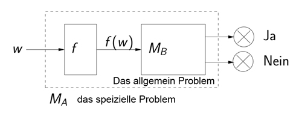
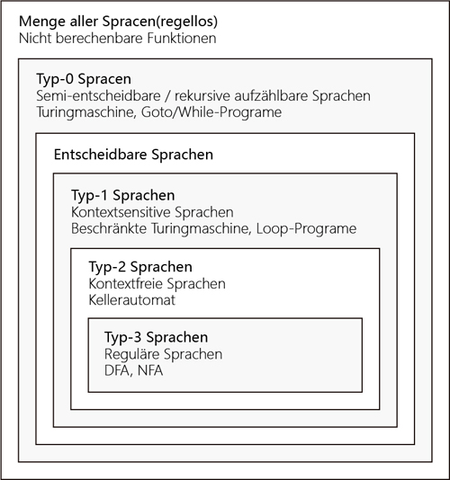

## Chomsky Hierarchie

* Menge aller Sprachen(formlos, 无生成规则)
* Typ-0 Sprachen (Semi-entscheidbare Sprachen, 有生成规则，但无限制)
 * allgemeine Turingmaschine
 * while-Programme, goto-Programe
 * $\mu$-rekursive Funktion
* Entscheidbare Sprachen ($SPACE(f(n))$)
* Typ-1 Sprachen (Kontextsensitive Sprachen, $SPACE(C \cdot n)$)
 * linear beschränkte Turingmaschine
* Typ-2 Sprachen (Kontextfreie Sprachen)
 * Kellerautomaten
* Typ-3 Sprachen (Reguläre Sprachen)

## Turingmaschinen

Eine (deterministische) Turingmaschine M ist ein 7-Tupel $M = (Z, \Sigma, \Gamma, \delta, z_0, \Box, E)$, wobei
* $Z$ die **endliche** Menge der Zustände
* $\Sigma$ das Eingabealphabet
* $\Gamma$ mit $\Sigma \subset \Gamma$ das Arbeitsalphabet oder Bandalphabet
* $z_0 \in Z$ der Startzustand
* $\delta : Z \times \Gamma \to Z \times \Gamma \times \{L,R,N\}$ die Überführungsfunktion
* $\Box \in \Gamma \setminus \Sigma$ das Leerzeichen oder Blank
* $E \subseteq Z$ die Menge der Endzustände ist.

Überführungsfunktion für **nichtdeterministische** Turingmaschine:
$\delta : Z \times \Gamma \to \mathcal{P} (Z \times \Gamma \times \{L,R,N\})$

**Konfiguration einer Turingmaschine**
Beispiel: für $\delta(z_1,b_1) = (z_2,c,N)$ gilt: $a_1 \dots a_m z_1 b_1 b_2 \dots b_n \vdash a_1 \dots a_m z_2 c b_2 \dots b_n$

**Linear beschränkte Turingmaschine**

Falls nur Zeichen der Eingabe überschrieben werden

**Ergebnis für Chosky-1 und Chomsky-0 Sprachen**

| Berechnungsmodelle | Abschluss under komplement | Determinismus und Nichtdeterminismus |
| --- |--- |--- |
| Turingmachinen | nicht notwendigerweise | gleich ausdruckmächtig |
| LBA | Ja | nicht bekannt |  

## Berechenbarkeit

**Definition**
Eine Funktion $f: \mathbb{N}_0^k \to \mathbb{N}_0$ soll als berechenbar angesehen werden, wenn es ein **Rechenverfahren**/einen **Algorithmus**/ein **Programm** gibt, das f berechnet

**Unterschied zwischen abzählbar und rekursive aufzählbar**
* Eine Menge M wird abzählbar genannt, wenn sie entweder endlich ist oder wenn es eine surjektive totale Funktion f : N → M gibt.
* Rekursiv aufzählbar ist sie dann, wenn es gelingt, f durch eine (turing-)berechenbare Funktion zu implementieren. Wenn L also mit finiten Mitteln, d. h. durch einendliches Bildungsgesetz beschrieben werden kann.

**Eigenschaften von Mengen (Sprachen)**
* Entscheidbare Menge $ \subset $ Aufzählbare Menge $ \subset $ Abzählbare Menge = Alle Sprache = $\mathcal{P}(\Sigma^*)$
* D.h, eine Sprache $L \subset \Sigma^*$ ist stets abzählbar.

**Churchsche These**, folgende Berechensmodelle sind äquivalent:
* Turing-berechenbare Funktionen
* while-berechenbare Funktionen
* goto-berechenbare Funktionen
* $\mu$ -rekursive Funktionen
* im intuitiven Sinne berechenbare Funktionen (nicht formal definiert)

**Nicht-berechenbare Funktionen**
* Es gibt Funktionen der Form $f: \mathbb{N}_0 \to \mathbb{N}_0$ , die nicht berechenbar sind，比如真随机函数
> wie Menge aller Sprachen, die nicht vom Typ-0 sind, formlos konstruierte Sprachen
* Es gibt überabzählbar viele (totale) Funktionen

**Beispiel für Turing-berechenbare Funktionen**
* Die Nachfolgerfunktion $n \to n + 1$
* überall undefinierte Funktion
* charakteristische Funktion von Type-0 Sprache

**Mehrband-Turingmaschine**

**Loop-, While-, Goto-Berechenbarkeit**

**Primitiv rekursive und $\mu$ - rekursive Funtionen**

**Überblick**

| Entscheidbarkeit(des Wortproblmes) | Zählbarkeit | Berechensmodelle | Sprachen |
| ------------ | ------------ | ------------ | ------------ |
| unentscheidbar (kein Ja and Nein)  | abzählbar | keine | Alle Sprache |
| semi-entscheidbar (nur Ja) | rekursive aufzählbar  | Turing-Maschine, $\mu$ -rekursive Funktionen, while-Programme, goto-Programme | Chomsky-0 |
| entscheidbar (immer Ja oder Nein) | aufzählbar | Loop-Programme, LBA, primitive rekursive Funktionen | Chomsky-1 |
| entscheidbar  | aufzählbar | Kellerautomaten | Chomsky-2 |
| entscheidbar  | aufzählbar | DFA,NFA | Chomsky-3 |

## Entscheidbarkeit

**Entscheidbarkeit**
Eine Sprache $A \subset \Sigma^{\ast}$ heißt entscheidbar, falls die charakteristische Funktion von A berechenbar ist, also es gibt eine Maschine $M_A$, die bei jeder Eingabe von $w \in \Sigma^{\ast}$ endliche Zeit rechnet und dann entweder Ja oder Nein ausgibt

**Semi-Entscheidbarkeit**
Eine Sprache $A \subset \Sigma^{\ast}$ heißt semi-entscheidbar, falls die **"halbe" ** charakteristische Funktion von A berechenbar ist

**Rekursive Aufzählbarkeit**
Eine Sprach $A \subset \Sigma^{\ast}$ heißt rekursive aufzählbar, falls es gibt eine totale und berechenbare Funktion $f: \mathbb{N}_0 \to \Sigma^{\ast}$ mit
$A = \{f(n) | n \in \mathbb{N}_0 \} = \{f(0),f(1),f(2),\dots \}$

**Abzählbarkeit**
Änhlich wie oben definiert, nur $f$ nicht unbedinnt berechenbar ist.
A rekursive aufzählbarkeit $\implies$ A abzählbar

**Unentscheidbarkeit des Halteproblems**

Das (allgemeine) Halteproblem ist die Sprache $H = \{ (w, x) | M_w \text{ auf x hält } \} $ ist **unentscheidbar**
> 输入为任意一个图灵机Prog和任意一个字符串Str，不存在一个图灵机能够判断输入的图灵机Prog在字符Str串上停机，不存在一个具有上帝能力的能够洞察一切的图灵机或者机械算法

Das **speizielle** Halteproblem ist die Sprache $H = \{ w | M_w \text{ auf w hält } \}$ ist **semi-entscheidbar**
> 输入为任意一个图灵机Prog与该图灵机本身的编码字符串Str

**Reduktionen**

- Entscheidbarkeit $B \implies A$
- Unntscheidbarkeit $A \implies B$

**Satz von Rice**

Es ist unentscheidbar, ob die turing-berechenbare Funktionen eine bestimmte **Eigenschaft** hat
> 没有图灵机或者算法可以判定由图灵机计算的函数具有的可数学归纳的特征

Konsequenze aus des Satz von Rice, folgende Probleme sind unentscheidbar
- Konstante Funktion
- Identität
- Totale Funktion
- Überall undefinierte Funktion
- Haltproblem für Goto-/While-Programme
- Goto-Programme mit zwei Variablen

Bemerkung: Goto-Programme mit nur einer Variable ist entscheidbar

**Unentscheidbare Probleme**
- Adventure Problem
- Postsches Korrespondenproblem
- Schnittproblem für kontextfreie Grammatiken

**Sprachen und Entscheidbarkeit**
- Das Schnittproblem für Kontextfrei Grammatiken ist unentscheidbar
- Eine Sprache A ist entscheidbar, wenn sowohl A als auch das Komplement von A semi-entscheidbar
- Es gibt entscheidbare Sprachen(tolale und berechenbare Funktionen), die nicht von Typ-1 Sprachen(Loop-berechenbar) sind
- Es ist unentscheidbar, eine Klasse(eine Eigenschaft) von Grammatikien der entscheidbaren Sprachen zu definieren

